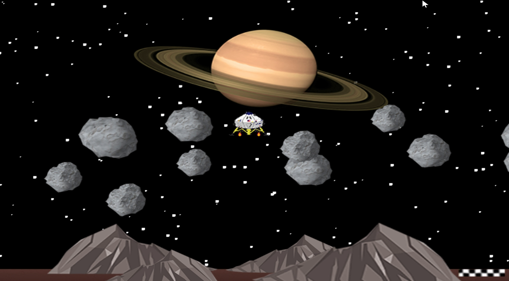

# Lunar Land

About the game
==============
Lunar land is a very small project developed as a mid-year exercise in the first year of the game programming course at AIV. It was developed without the aid of graphics engines, using only C#. At each start the map is created randomly, making sure to always leave the space necessary for the spacecraft to pass between the asteroids and reach the ultimate goal.

There is a gameplay video on Youtube: https://youtu.be/Y572m7SJz3A

